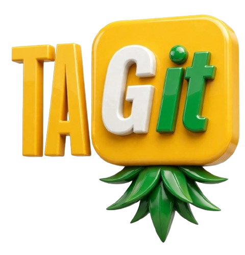

# TAGit 🍍 — Tag It. Own Your Content.



> Property of **Jozi Nites (Pty) Ltd** — All Rights Reserved

**Live:** [https://tag-it-sigma.vercel.app](https://tag-it-sigma.vercel.app)  
**Studio:** [https://tag-it-sigma.vercel.app/studio](https://tag-it-sigma.vercel.app/studio)

---

### What is TAGit?

**TAGit** is a free, privacy-first, browser-based watermark studio.  
Upload your logo (or enter a text watermark) + any single image or batch of images, pick a style preset, tweak size / opacity / rotation, and download individually or export as a ZIP — ready to post.

It’s never been easier to watermark or tag your content before you share it.

**100% Free · No sign-up · Files stay in your browser**

---

### How it works

1. **Upload Logo or Text Watermark** — PNG, SVG, WebP, JPG or type custom text handle
2. **Upload Media (Single or Batch)** — Drop individual images or multiple files for batch processing
3. **Position & Quick Presets** — 9-point grid, free canvas drag, and 1-click presets (Corner Badge, Center Stamp, Subtle Overlay, Diagonal Tile)
4. **Live Preview** — Real-time canvas preview with batch queue navigation
5. **Download / ZIP Export** — Get your tagged image or export all watermarked media as a ZIP archive instantly

---

### Features

- **Drag & drop upload zones** with strict MIME validation & size limit protection (25MB cap)
- **Batch Processing & ZIP Export** — Upload multiple images and download all watermarked files in a single `.zip`
- **Logo AI Background Removal** — Integrated client-side background remover (`@imgly/background-removal`)
- **Text Watermark Support** — Add custom text handle (e.g. `@jozinites`), choose font size & color
- **Quick Style Presets** — Corner Badge, Center Stamp, Subtle Overlay, Diagonal Tile
- **Export Controls** — Export as PNG, JPEG, or WebP with configurable compression quality
- **Mobile PWA Support** — Installable Web App Manifest (`manifest.json`)
- **Security & Privacy First** — HTTP Security Headers, Content Security Policy, and zero server upload (all files stay in local browser memory)
- **Dark neon Jozi-inspired design**

---

### Security & Governance

- **Repository Security Configs:** Includes `.gitignore` protecting build artifacts and environment variables.
- **Security Policy (`SECURITY.md`):** Formal vulnerability disclosure process.
- **Dependency Hardening:** Updated Next.js framework dependencies (`^14.2.35`) to remediate known security advisories.
- **HTTP Security Headers:** Configured HSTS, CSP, X-Frame-Options, X-Content-Type-Options, and Referrer-Policy headers.

---

### Tech Stack

- Next.js 14 (App Router)
- TypeScript & React 18
- Tailwind CSS
- HTML Canvas API
- JSZip (Batch Archiving)
- @imgly/background-removal (AI transparent logo processing)
- Vercel

---

### Progress

- [x] Project scaffolded
- [x] Studio live at `/studio`
- [x] Branding locked (yellow + green pineapple style)
- [x] 3D logo
- [x] Vercel deployment live (`tag-it-sigma`)
- [x] Security Policy (`SECURITY.md`), security headers & file validation
- [x] Batch processing & ZIP download
- [x] Mobile PWA support (`app/manifest.ts`)
- [ ] Auth / user accounts (optional)
- [ ] Save projects / history
- [ ] Video watermark support

**Current Version:** `v0.3.0` — Batch & Security Hardened Phase

---

### Local Development

```bash
git clone https://github.com/Jozi-Nites-Hub/Tag-it.git
cd Tag-it
npm install
npm run dev
npm run build

---

All files are created and updated in the project repository directory and archived in `tag-it-repository.zip` (6.5 MB)!
